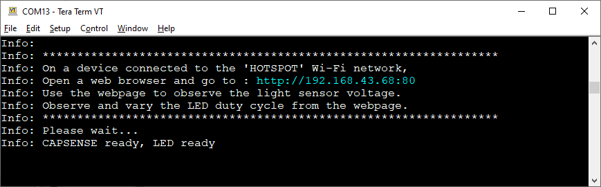

# Wi-Fi web server

This code example demonstrates Wi-Fi provisioning via a SoftAP and setting up a web server with PSoC™ 6 MCU with AIROC™ CYW43xxx Wi-Fi & Bluetooth® combo chips.

In this example, the PSoC&trade; 6 MCU device is configured in AP+STA concurrent mode. It starts an HTTP web server while in AP+STA concurrent mode and hosts an HTTP web page. The kit can be connected to the desired Wi-Fi network using the credentials entered via this HTTP web page. After connecting to the specified Wi-Fi network, the device is reconfigured to start a new HTTP web server. The new web server displays the device data containing ambient light sensor (ALS) values, and buttons to change the brightness of an LED on a web page.

[View this README on GitHub.](https://github.com/Infineon/mtb-example-wifi-web-server)

[Provide feedback on this code example.](https://cypress.co1.qualtrics.com/jfe/form/SV_1NTns53sK2yiljn?Q_EED=eyJVbmlxdWUgRG9jIElkIjoiQ0UyMzMyNDYiLCJTcGVjIE51bWJlciI6IjAwMi0zMzI0NiIsIkRvYyBUaXRsZSI6IldpLUZpIHdlYiBzZXJ2ZXIiLCJyaWQiOiJzZGFrIiwiRG9jIHZlcnNpb24iOiIyLjEuMCIsIkRvYyBMYW5ndWFnZSI6IkVuZ2xpc2giLCJEb2MgRGl2aXNpb24iOiJNQ0QiLCJEb2MgQlUiOiJJQ1ciLCJEb2MgRmFtaWx5IjoiUFNPQyJ9)

## Requirements

- [ModusToolbox&trade; software](https://www.infineon.com/modustoolbox) v3.1 or later (tested with v3.1)
- Board support package (BSP) minimum required version: 4.0.0
- Programming language: C
- Associated parts: All [PSoC&trade; 6 MCU](https://www.infineon.com/cms/en/product/microcontroller/32-bit-psoc-arm-cortex-microcontroller/psoc-6-32-bit-arm-cortex-m4-mcu) parts, [AIROC&trade; CYW20819 Bluetooth&reg; & Bluetooth&reg; LE system on chip](https://www.infineon.com/cms/en/product/wireless-connectivity/airoc-bluetooth-le-bluetooth-multiprotocol/airoc-bluetooth-le-bluetooth/cyw20819), [AIROC&trade; CYW43012 Wi-Fi & Bluetooth&reg; combo chip](https://www.infineon.com/cms/en/product/wireless-connectivity/airoc-wi-fi-plus-bluetooth-combos/wi-fi-4-802.11n/cyw43012), [AIROC&trade; CYW4343W Wi-Fi & Bluetooth&reg; combo chip](https://www.infineon.com/cms/en/product/wireless-connectivity/airoc-wi-fi-plus-bluetooth-combos/wi-fi-4-802.11n/cyw4343w), [AIROC&trade; CYW4373 Wi-Fi & Bluetooth&reg; combo chip](https://www.infineon.com/cms/en/product/wireless-connectivity/airoc-wi-fi-plus-bluetooth-combos/wi-fi-5-802.11ac/cyw4373), [AIROC&trade; CYW43439 Wi-Fi & Bluetooth&reg; combo chip](https://www.infineon.com/cms/en/product/wireless-connectivity/airoc-wi-fi-plus-bluetooth-combos/wi-fi-4-802.11n/cyw43439)

## Supported toolchains (make variable 'TOOLCHAIN')

- GNU Arm&reg; embedded compiler v11.3.1 (`GCC_ARM`) - Default value of `TOOLCHAIN`
- Arm&reg; compiler v6.16 (`ARM`)
- IAR C/C++ compiler v9.30.1 (`IAR`)


## Supported kits (make variable 'TARGET')


- [PSoC&trade; 6 Wi-Fi Bluetooth&reg; Prototyping Kit](https://www.infineon.com/CY8CPROTO-062-4343W) (`CY8CPROTO-062-4343W`) - Default value of `TARGET`
- [PSoC&trade; 6 Wi-Fi Bluetooth&reg; Pioneer Kit](https://www.infineon.com/CY8CKIT-062-WIFI-BT) (`CY8CKIT-062-WIFI-BT`)
- [PSoC&trade; 62S2 Wi-Fi Bluetooth&reg; Pioneer Kit](https://www.infineon.com/CY8CKIT-062S2-43012) (`CY8CKIT-062S2-43012`)
- [PSoC&trade; 62S1 Wi-Fi Bluetooth&reg; Pioneer Kit](https://www.infineon.com/CYW9P62S1-43438EVB-01) (`CYW9P62S1-43438EVB-01`)
- [PSoC&trade; 62S1 Wi-Fi Bluetooth&reg; Pioneer Kit](https://www.infineon.com/CYW9P62S1-43012EVB-01) (`CYW9P62S1-43012EVB-01`)
- [PSoC&trade; 62S3 Wi-Fi Bluetooth&reg; Prototyping Kit](https://www.infineon.com/CY8CPROTO-062S3-4343W) (`CY8CPROTO-062S3-4343W`)
- [PSoC&trade; 64 "Secure Boot" Wi-Fi Bluetooth&reg; Pioneer Kit](https://www.infineon.com/CY8CKIT-064B0S2-4343W) (`CY8CKIT-064B0S2-4343W`)
- [PSoC&trade; 62S2 Evaluation Kit](https://www.infineon.com/CY8CEVAL-062S2) (`CY8CEVAL-062S2-LAI-4373M2`, `CY8CEVAL-062S2-LAI-43439M2`, `CY8CEVAL-062S2-MUR-43439M2`, `CY8CEVAL-062S2-MUR-4373EM2`)
- [PSoC&trade; 62S2 Wi-Fi Bluetooth&reg; prototyping kit](https://www.infineon.com/CY8CPROTO-062S2-43439) (`CY8CPROTO-062S2-43439`)

## Hardware setup

The code example can be configured to work with or without the [CY8CKIT-028-TFT TFT display shield board](https://www.infineon.com/cms/en/product/evaluation-boards/cy8ckit-028-tft). This shield comes with [PSoC&trade; 6 Wi-Fi Bluetooth&reg; pioneer kit](https://www.infineon.com/CY8CKIT-062-WIFI-BT). It can also be purchased standalone and used with other supported kits.

**Note:** The PSoC&trade; 6 Wi-Fi Bluetooth&reg; pioneer kit (CY8CKIT-062-WIFI-BT) ships with KitProg2 installed. The ModusToolbox&trade; software requires KitProg3. Before using this code example, make sure that the board is upgraded to KitProg3. The tool and instructions are available in the [Firmware Loader](https://github.com/Infineon/Firmware-loader) GitHub repository. If you do not upgrade, you will see an error like "unable to find CMSIS-DAP device" or "KitProg firmware is out of date".

## Software setup

1. Install a terminal emulator if you don't have one. Instructions in this document use [Tera Term](https://ttssh2.osdn.jp/index.html.en).

2. This example requires no additional software or tools.


## Using the code example

Create the project and open it using one of the following:

<details><summary><b>In Eclipse IDE for ModusToolbox&trade; software</b></summary>

1. Click the **New Application** link in the **Quick Panel** (or, use **File** > **New** > **ModusToolbox&trade; Application**). This launches the [Project Creator](https://www.infineon.com/ModusToolboxProjectCreator) tool.

2. Pick a kit supported by the code example from the list shown in the **Project Creator - Choose Board Support Package (BSP)** dialog.

   When you select a supported kit, the example is reconfigured automatically to work with the kit. To work with a different supported kit later, use the [Library Manager](https://www.infineon.com/ModusToolboxLibraryManager) to choose the BSP for the supported kit. You can use the Library Manager to select or update the BSP and firmware libraries used in this application. To access the Library Manager, click the link from the **Quick Panel**.

   You can also just start the application creation process again and select a different kit.

   If you want to use the application for a kit not listed here, you may need to update the source files. If the kit does not have the required resources, the application may not work.

3. In the **Project Creator - Select Application** dialog, choose the example by enabling the checkbox.

4. (Optional) Change the suggested **New Application Name**.

5. The **Application(s) Root Path** defaults to the Eclipse workspace which is usually the desired location for the application. If you want to store the application in a different location, you can change the *Application(s) Root Path* value. Applications that share libraries should be in the same root path.

6. Click **Create** to complete the application creation process.

For more details, see the [Eclipse IDE for ModusToolbox&trade; software user guide](https://www.infineon.com/MTBEclipseIDEUserGuide) (locally available at *{ModusToolbox&trade; software install directory}/docs_{version}/mtb_ide_user_guide.pdf*).

</details>

<details><summary><b>In command-line interface (CLI)</b></summary>

ModusToolbox&trade; software provides the Project Creator as both a GUI tool and the command line tool, "project-creator-cli". The CLI tool can be used to create applications from a CLI terminal or from within batch files or shell scripts. This tool is available in the *{ModusToolbox&trade; software install directory}/tools_{version}/project-creator/* directory.

Use a CLI terminal to invoke the "project-creator-cli" tool. On Windows, use the command line "modus-shell" program provided in the ModusToolbox&trade; software installation instead of a standard Windows command-line application. This shell provides access to all ModusToolbox&trade; software tools. You can access it by typing `modus-shell` in the search box in the Windows menu. In Linux and macOS, you can use any terminal application.

The "project-creator-cli" tool has the following arguments:

Argument | Description | Required/optional
---------|-------------|-----------
`--board-id` | Defined in the `<id>` field of the [BSP](https://github.com/Infineon?q=bsp-manifest&type=&language=&sort=) manifest | Required
`--app-id`   | Defined in the `<id>` field of the [CE](https://github.com/Infineon?q=ce-manifest&type=&language=&sort=) manifest | Required
`--target-dir`| Specify the directory in which the application is to be created if you prefer not to use the default current working directory | Optional
`--user-app-name`| Specify the name of the application if you prefer to have a name other than the example's default name | Optional

<br>

The following example clones the "[mtb-example-wifi-web-server](https://github.com/Infineon/mtb-example-wifi-web-server)" application with the desired name "WebServer" configured for the *CY8CKIT-062-WIFI-BT* BSP into the specified working directory, *C:/mtb_projects*:

   ```
   project-creator-cli --board-id CY8CKIT-062-WIFI-BT --app-id mtb-example-wifi-web-server --user-app-name WebServer --target-dir "C:/mtb_projects"
   ```

**Note:** The project-creator-cli tool uses the `git clone` and `make getlibs` commands to fetch the repository and import the required libraries. For details, see the "Project creator tools" section of the [ModusToolbox&trade; software user guide](https://www.infineon.com/ModusToolboxUserGuide) (locally available at *{ModusToolbox&trade; software install directory}/docs_{version}/mtb_user_guide.pdf*).

To work with a different supported kit later, use the [Library Manager](https://www.infineon.com/ModusToolboxLibraryManager) to choose the BSP for the supported kit. You can invoke the Library Manager GUI tool from the terminal using `make library-manager` command or use the Library Manager CLI tool "library-manager-cli" to change the BSP.

The "library-manager-cli" tool has the following arguments:

Argument | Description | Required/optional
---------|-------------|-----------
`--add-bsp-name` | Name of the BSP that should be added to the application | Required
`--set-active-bsp` | Name of the BSP that should be as active BSP for the application | Required
`--add-bsp-version`| Specify the version of the BSP that should be added to the application if you do not wish to use the latest from manifest | Optional
`--add-bsp-location`| Specify the location of the BSP (local/shared) if you prefer to add the BSP in a shared path | Optional

<br />

The following example adds the CY8CPROTO-062-4343W BSP to the already created application and makes it the active BSP for the app:

   ```
   library-manager-cli --project "C:/mtb_projects/WebServer" --add-bsp-name CY8CPROTO-062-4343W --add-bsp-version "latest-v4.X" --add-bsp-location "local"

   library-manager-cli --project "C:/mtb_projects/WebServer" --set-active-bsp APP_CY8CPROTO-062-4343W
   ```

</details>

<details><summary><b>In third-party IDEs</b></summary>

Use one of the following options:

- **Use the standalone [Project Creator](https://www.infineon.com/ModusToolboxProjectCreator) tool:**

   1. Launch Project Creator from the Windows Start menu or from *{ModusToolbox&trade; software install directory}/tools_{version}/project-creator/project-creator.exe*.

   2. In the initial **Choose Board Support Package** screen, select the BSP, and click **Next**.

   3. In the **Select Application** screen, select the appropriate IDE from the **Target IDE** drop-down menu.

   4. Click **Create** and follow the instructions printed in the bottom pane to import or open the exported project in the respective IDE.

<br />

- **Use command-line interface (CLI):**

   1. Follow the instructions from the **In command-line interface (CLI)** section to create the application.

   2. Export the application to a supported IDE using the `make <ide>` command.

   3. Follow the instructions displayed in the terminal to create or import the application as an IDE project.

For a list of supported IDEs and more details, see the "Exporting to IDEs" section of the [ModusToolbox&trade; software user guide](https://www.infineon.com/ModusToolboxUserGuide) (locally available at *{ModusToolbox&trade; software install directory}/docs_{version}/mtb_user_guide.pdf*).

</details>


## Operation


If using a PSoC&trade; 64 "Secure" MCU kit (like CY8CKIT-064B0S2-4343W), the PSoC&trade; 64 device must be provisioned with keys and policies before being programmed. Follow the instructions in the ["Secure Boot" SDK user guide](https://www.infineon.com/dgdlac/Infineon-PSoC_64_Secure_MCU_Secure_Boot_SDK_User_Guide-Software-v07_00-EN.pdf?fileId=8ac78c8c7d0d8da4017d0f8c361a7666) to provision the device. If the kit is already provisioned, copy-paste the keys and policy folder to the application folder.

**Note:**  Use the *policy_single_CM0_CM4_smif_swap.json* policy instead of using the default one "policy_single_CM0_CM4_swap.json" to provision the CY8CKIT-064B0S2-4343W device.

1. Connect the board to your PC using the provided USB cable through the KitProg3 USB connector.

2. Open *Makefile* and modify the `ENABLE_TFT` macro to enable or disable the TFT functionality.

   **Note:** The TFT display shield board is not compatible with PSoC&trade; 6 Wi-Fi Bluetooth&reg; prototyping kit (CY8CPROTO-062-4343W) and PSoC&trade; 62S1 Wi-Fi Bluetooth&reg; pioneer kit (CYW9P62S1-43012EVB-01). Therefore, by default, the TFT functionality is disabled.

3. Open *web_server.h* from the source directory and modify the `SOFTAP_SSID`, `SOFTAP_PASSWORD`, and `SOFTAP_SECURITY_TYPE` macros to the desired values that you want to allot to the SoftAP.

   All possible security types are defined in the `cy_wcm_security_t` structure in the *cy_wcm.h* file.

4. Modify the IP address assigned to the SoftAP by updating the `SOFTAP_IP_ADDRESS` macro defined in the *web_server.h* file.

    For example, if you are assigning the SoftAP with the IP address `192.168.0.2`, update the macro as follows:
    ```
    #define SOFTAP_IP_ADDRESS             MAKE_IPV4_ADDRESS(192, 168, 0, 2)
    ```

5. Open a terminal program and select the KitProg3 COM port. Set the serial port parameters to 8N1 and 115200 baud.

6. Program the board using one of the following:

   <details><summary><b>Using Eclipse IDE for ModusToolbox&trade; software</b></summary>

      1. Select the application project in the Project Explorer.

      2. In the **Quick Panel**, scroll down, and click **\<Application Name> Program (KitProg3_MiniProg4)**.
   </details>

   <details><summary><b>Using CLI</b></summary>

     From the terminal, execute the `make program` command to build and program the application using the default toolchain to the default target. The default toolchain is specified in the application's Makefile but you can override this value manually:
      ```
      make program TOOLCHAIN=<toolchain>
      ```

      Example:
      ```
      make program TOOLCHAIN=GCC_ARM
      ```
   </details>

7. After programming, the application starts automatically. Verify that the following logs appear on the serial terminal (details such as the MAC address will be different):

   ```
    Info: ============================================================
    Info:                Wi-Fi Web Server
    Info: ============================================================

    WLAN MAC Address : E8:E8:B7:A0:2C:C0
    WLAN Firmware    : wl0: Apr 26 2021 04:04:15 version 13.10.271.265 (aa096f9 CY) FWID 01-29e05f8
    WLAN CLM         : API: 18.2 Data: 9.10.0 Compiler: 1.36.1 ClmImport: 1.34.1 Creation: 2021-04-26 04:01:15
    WHD VERSION      : v1.94.0 : v1.94.0 : GCC 9.3 : 2021-04-27 16:54:34 +0800

    Info: ****************************************************************************
    Info: Using another device, connect to the following Wi-Fi network:
    Info: SSID     : SOFTAP_SSID
    Info: Password : SOFTAP_PWD
    Info: Open a web browser of your choice and enter the URL http://192.168.0.2:80
    Info: This opens up the home page for web server application.
    Info: You can either enter Wi-Fi network name and password directly or
    Info: perform a Wi-Fi scan to get the list of available APs.
    Info: ****************************************************************************

   ```
8. Connect your PC to the SoftAP using the credentials updated in Step 3.

9. Open the web browser of your choice and enter the URL `http://<IP address>:80`, where the IP address is the one that was updated in Step 4. This will open the home page for the web server application. This will look like the following:

   **Figure 1. Wi-Fi web server - home page**

   

10. If the Wi-Fi network and its credentials are already known, enter these directly and click **Connect to Wi-Fi**. This sends an HTTP `POST` command to the server running on the kit. If the credentials entered by you are correct, you will be redirected to a page where you have options to return to the home page or display the device data. If the credentials are incorrect, you will have only one option, that is to return back to the home page.

      **Figure 2. Connection to Wi-Fi failed**

      

      <br>

      **Figure 3. Connection to Wi-Fi success**

      

11. If the Wi-Fi APs are unknown, click **Scan for Wi-Fi Access Points** to perform a Wi-Fi scan to get the list of available APs. This sends an HTTP `GET` command to the server running on the kit.

    This redirects to another web page which is populated with the list of available Wi-Fi APs. The list of available APs  is returned by the server as a response to the HTTP `GET` command. The web page will also contain a login form to enter Wi-Fi credentials. The web page will look like the following:

      **Figure 4. Available access points**

      

12. After the device is successfully connected to the network, click **Display Device Data**. This redirects to another web page which instructs you to follow the instructions in the UART terminal to view the device data.

      **Figure 5. Display device data - redirect web page**

      

      <br>

      **Figure 6. UART - instructions to view the device data**

      

13. Connect your PC to the same Wi-Fi AP whose credentials you have entered in Step 10 or Step 11.

14. Open the web browser of your choice and enter the URL `http://<IP address>:80`, where the IP address is the one that is displayed on the UART terminal. This will open the web page that displays the real-time device data.

      **Figure 4. Device data - web page**

      

15. Do one of the following to vary the brightness of the user LED:
    - Click the **Increase**/**Decrease** button from the web page.

    - Touch the CAPSENSE&trade; slider at different positions.

    - Touch the CAPSENSE&trade; button (BTN1/BTN0).

**Note:** The light sensor voltage displayed on the web page is measured by the ambient light sensor present in the TFT display shield board. Therefore, this will not be displayed for PSoC&trade; 6 Wi-Fi Bluetooth&reg; prototyping kit (CY8CPROTO-062-4343W) and PSoC&trade; 62S1 Wi-Fi Bluetooth&reg; pioneer kit (CYW9P62S1-43012EVB-01).


## Debugging

You can debug the example to step through the code. In the IDE, use the **\<Application Name> Debug (KitProg3_MiniProg4)** configuration in the **Quick Panel**. For details, see the "Program and debug" section in the [Eclipse IDE for ModusToolbox&trade; software user guide](https://www.infineon.com/MTBEclipseIDEUserGuide).

**Note:** **(Only while debugging)** On the CM4 CPU, some code in `main()` may execute before the debugger halts at the beginning of `main()`. This means that some code executes twice - once before the debugger stops execution, and again after the debugger resets the program counter to the beginning of `main()`. See [KBA231071](https://community.infineon.com/docs/DOC-21143) to learn about this and for the workaround.


## Design and implementation

### Resources and settings

**Table 1. Application resources**

| Resource  |  Alias/object     |    Purpose     |
| :------- | :------------    | :------------ |
| UART (HAL) |cy_retarget_io_uart_obj| UART HAL object used by retarget-io for Debug UART port |
| GPIO (HAL)    | CYBSP_USER_LED         |  User LED to show the visual output                     |
| PWM (HAL)     | pwm_led                |  PWM HAL object used to vary the LED brightness         |

<br />

This example uses the Arm® Cortex®-M4 (CM4) CPU of PSoC&trade; 6 MCU to start the `server_task`. At device reset, the default Cortex&reg;-M0+ (CM0+) application enables the CM4 CPU and configures the CM0+ CPU to go to sleep.

The [Wi-Fi web server](https://github.com/Infineon/mtb-example-wifi-web-server) code example configures the device in AP+STA concurrent mode and starts an HTTP web server. The HTTP web server then hosts an HTTP web page using which the device can be connected to a Wi-Fi AP. A new web server is started after the device gets connected to Wi-Fi AP and the device data is displayed on a web page hosted by this web server.

The entry point of the application is `int main()`, which initializes the board support package (BSP), initializes retarget-io to use the debug UART port, and creates `server_task`. This task calls `start_ap_mode()`, which initializes the Wi-Fi device as a SoftAP and prints the IP address assigned to the SoftAP on the UART terminal. The `initialize_display()` function initializes and sets up the TFT display.

Before starting the HTTP web server, the `configure_http_server()` function registers dynamic URL handlers to handle the HTTP `GET` and `POST` requests. After this, the web page hosted by the HTTP server can be accessed at the URL `http://<IP address>:80`, where the IP address is defined using the `SOFTAP_IP_ADDRESS` macro in the *web_server.h* file.

The data entered via the web page undergoes URL encoding; a custom function, `url_decode()`, is used to decode the URL-encoded HTTP data.

The IP address of the STA interface is retrieved after the device gets connected to the Wi-Fi AP. The `reconfigure_http_server()` function deletes the existing HTTP server instance and creates a new server instance using this IP address. The device data (ambient light sensor voltage and LED brightness value) is retrieved and displayed every 50 ms on the TFT display shield as well as the web page hosted by the new server instance. The device initializes the ambient light sensor, CAPSENSE&trade;, and LED using the `initialize_sensors()` function.

The application uses a UART resource from the hardware abstraction layer (HAL) to print debug messages on a UART terminal emulator. The UART resource initialization and retargeting of the standard I/O to the UART port is done using the retarget-io library.

## Related resources

Resources  | Links
-----------|----------------------------------
Application notes  | [AN228571](https://www.infineon.com/AN228571) – Getting started with PSoC&trade; 6 MCU on ModusToolbox&trade; software <br>  [AN215656](https://www.infineon.com/AN215656) – PSoC&trade; 6 MCU: Dual-CPU system design <br>  [AN85951](https://www.infineon.com/AN85951) – PSoC&trade; 4 and PSoC&trade; 6 MCU CAPSENSE&trade; design guide
Code examples  | [Using ModusToolbox&trade; software](https://github.com/Infineon/Code-Examples-for-ModusToolbox-Software) on GitHub
Device documentation | [PSoC&trade; 6 MCU datasheets](https://documentation.infineon.com/html/psoc6/bnm1651211483724.html) <br> [PSoC&trade; 6 technical reference manuals](https://documentation.infineon.com/html/psoc6/zrs1651212645947.html)Development kits | Select your kits from the [evaluation board finder](https://www.infineon.com/cms/en/design-support/finder-selection-tools/product-finder/evaluation-board)
Libraries on GitHub  | [mtb-pdl-cat1](https://github.com/Infineon/mtb-pdl-cat1) – PSoC&trade; 6 peripheral driver library (PDL)  <br> [mtb-hal-cat1](https://github.com/Infineon/mtb-hal-cat1) – Hardware abstraction layer (HAL) library <br> [retarget-io](https://github.com/Infineon/retarget-io) – Utility library to retarget STDIO messages to a UART port
Middleware on GitHub  | [capsense](https://github.com/Infineon/capsense) – CAPSENSE&trade; library and documents <br> [psoc6-middleware](https://github.com/Infineon/modustoolbox-software#psoc-6-middleware-libraries) – Links to all PSoC&trade; 6 MCU middleware
Tools  | [Eclipse IDE for ModusToolbox&trade; software](https://www.infineon.com/modustoolbox) – ModusToolbox&trade; software is a collection of easy-to-use software and tools enabling rapid development with Infineon MCUs, covering applications from embedded sense and control to wireless and cloud-connected systems using AIROC&trade; Wi-Fi and Bluetooth&reg; connectivity devices.

<br>

## Other resources

Infineon provides a wealth of data at www.infineon.com to help you select the right device, and quickly and effectively integrate it into your design.

For PSoC&trade; 6 MCU devices, see [How to design with PSoC&trade; 6 MCU – KBA223067](https://community.infineon.com/docs/DOC-14644) in the Infineon Developer community.


## Document history

Document title: *CE233246* – *Wi-Fi web server*

| Version | Description of change |
| ------- | --------------------- |
| 1.0.0   | New code example      |
| 2.0.0   | Major update to support ModusToolbox&trade; v3.0. This version is not backward compatible with previous versions of ModusToolbox&trade; |
| 2.0.1   | TFT display feature is disabled by default |
| 2.1.0   | Updated to support ModusToolbox&trade; software v3.1, CAPSENSE&trade; middleware v4.X and added support for CY8CEVAL-062S2-LAI-43439M2, CY8CEVAL-062S2-MUR-4373EM2, and CY8CPROTO-062S2-43439  |
<br>

---------------------------------------------------------

© Cypress Semiconductor Corporation, 2020-2023. This document is the property of Cypress Semiconductor Corporation, an Infineon Technologies company, and its affiliates ("Cypress").  This document, including any software or firmware included or referenced in this document ("Software"), is owned by Cypress under the intellectual property laws and treaties of the United States and other countries worldwide.  Cypress reserves all rights under such laws and treaties and does not, except as specifically stated in this paragraph, grant any license under its patents, copyrights, trademarks, or other intellectual property rights.  If the Software is not accompanied by a license agreement and you do not otherwise have a written agreement with Cypress governing the use of the Software, then Cypress hereby grants you a personal, non-exclusive, nontransferable license (without the right to sublicense) (1) under its copyright rights in the Software (a) for Software provided in source code form, to modify and reproduce the Software solely for use with Cypress hardware products, only internally within your organization, and (b) to distribute the Software in binary code form externally to end users (either directly or indirectly through resellers and distributors), solely for use on Cypress hardware product units, and (2) under those claims of Cypress’s patents that are infringed by the Software (as provided by Cypress, unmodified) to make, use, distribute, and import the Software solely for use with Cypress hardware products.  Any other use, reproduction, modification, translation, or compilation of the Software is prohibited.
<br />
TO THE EXTENT PERMITTED BY APPLICABLE LAW, CYPRESS MAKES NO WARRANTY OF ANY KIND, EXPRESS OR IMPLIED, WITH REGARD TO THIS DOCUMENT OR ANY SOFTWARE OR ACCOMPANYING HARDWARE, INCLUDING, BUT NOT LIMITED TO, THE IMPLIED WARRANTIES OF MERCHANTABILITY AND FITNESS FOR A PARTICULAR PURPOSE.  No computing device can be absolutely secure.  Therefore, despite security measures implemented in Cypress hardware or software products, Cypress shall have no liability arising out of any security breach, such as unauthorized access to or use of a Cypress product. CYPRESS DOES NOT REPRESENT, WARRANT, OR GUARANTEE THAT CYPRESS PRODUCTS, OR SYSTEMS CREATED USING CYPRESS PRODUCTS, WILL BE FREE FROM CORRUPTION, ATTACK, VIRUSES, INTERFERENCE, HACKING, DATA LOSS OR THEFT, OR OTHER SECURITY INTRUSION (collectively, "Security Breach").  Cypress disclaims any liability relating to any Security Breach, and you shall and hereby do release Cypress from any claim, damage, or other liability arising from any Security Breach.  In addition, the products described in these materials may contain design defects or errors known as errata which may cause the product to deviate from published specifications. To the extent permitted by applicable law, Cypress reserves the right to make changes to this document without further notice. Cypress does not assume any liability arising out of the application or use of any product or circuit described in this document. Any information provided in this document, including any sample design information or programming code, is provided only for reference purposes.  It is the responsibility of the user of this document to properly design, program, and test the functionality and safety of any application made of this information and any resulting product.  "High-Risk Device" means any device or system whose failure could cause personal injury, death, or property damage.  Examples of High-Risk Devices are weapons, nuclear installations, surgical implants, and other medical devices.  "Critical Component" means any component of a High-Risk Device whose failure to perform can be reasonably expected to cause, directly or indirectly, the failure of the High-Risk Device, or to affect its safety or effectiveness.  Cypress is not liable, in whole or in part, and you shall and hereby do release Cypress from any claim, damage, or other liability arising from any use of a Cypress product as a Critical Component in a High-Risk Device. You shall indemnify and hold Cypress, including its affiliates, and its directors, officers, employees, agents, distributors, and assigns harmless from and against all claims, costs, damages, and expenses, arising out of any claim, including claims for product liability, personal injury or death, or property damage arising from any use of a Cypress product as a Critical Component in a High-Risk Device. Cypress products are not intended or authorized for use as a Critical Component in any High-Risk Device except to the limited extent that (i) Cypress’s published data sheet for the product explicitly states Cypress has qualified the product for use in a specific High-Risk Device, or (ii) Cypress has given you advance written authorization to use the product as a Critical Component in the specific High-Risk Device and you have signed a separate indemnification agreement.
<br />
Cypress, the Cypress logo, and combinations thereof, WICED, ModusToolbox, PSoC, CapSense, EZ-USB, F-RAM, and Traveo are trademarks or registered trademarks of Cypress or a subsidiary of Cypress in the United States or in other countries. For a more complete list of Cypress trademarks, visit www.infineon.com. Other names and brands may be claimed as property of their respective owners.
